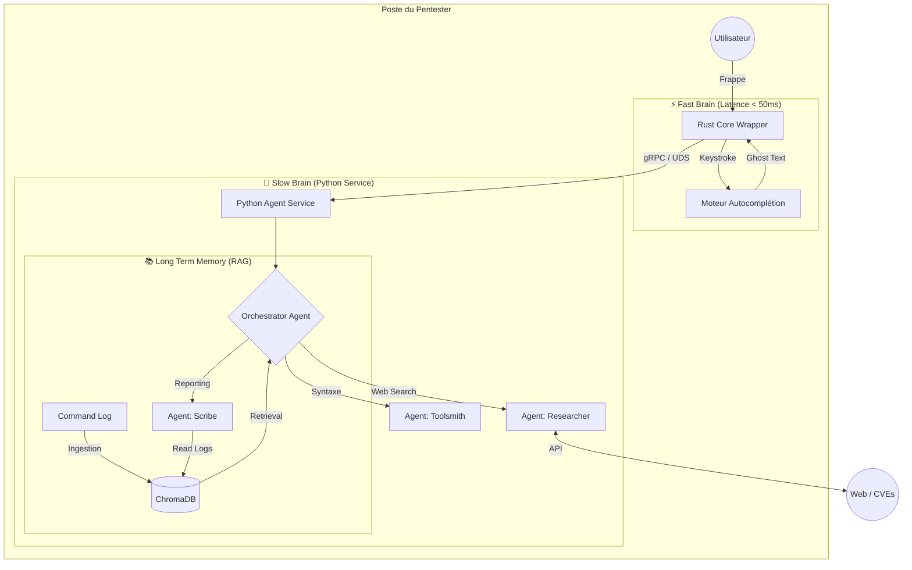

## 🏗 Architecture Technique

Ce projet repose sur une architecture hybride **Rust + Python** conçue pour concilier performance extrême (latence < 50ms pour la frappe) et puissance d'analyse (écosystème IA riche).

L'architecture suit le pattern **"Two Brains"** (Deux Cerveaux) :
1.  **Fast Brain (Rust/ONNX) :** Gestion temps réel, UI et autocomplétion.
2.  **Slow Brain (Python/Agents) :** Raisonnement complexe, RAG et outils externes.

### 📊 Vue d'Ensemble

### 🧱 Composants Principaux

## 1. Le Core (Rust Wrapper)

C'est le point d'entrée de l'application. Il agit comme un wrapper PTY (Pseudo-Terminal) autour du shell de l'utilisateur (zsh, bash).

# Rôle :

Intercepte STDIN pour l'autocomplétion.

Capture STDOUT pour alimenter la mémoire (RAG).

Gère l'interface graphique (TUI) via Ratatui pour l'overlay de chat sans polluer le flux standard.

Stack : Rust, portable-pty, ratatui, tonic (gRPC client).

# 2. Le Service Agent (Python)

Le cerveau du système, exécuté en arrière-plan. Il communique avec le Core via gRPC sur Unix Domain Sockets (pour éviter l'overhead TCP).

Rôle : Héberge les LLM, gère la logique des agents et maintient la base de données vectorielle.

Stack : Python, LangGraph (Orchestration), ChromaDB (Vector Store), SentenceTransformers (Embeddings locaux).

### 🧠 Stratégie "Two Brains"

Feature	Composant	Latence Cible	Modèle Typique	Description
Autocomplétion	Fast Brain	< 50ms	Codellama-7b (4-bit) ou SLM via ONNX	Suggère la fin de la commande basée sur l'historique immédiat et le contexte local.
Chat / Analyse	Slow Brain	~2-5s	GPT-4o (API) ou Llama-3 (Local)	Gère les demandes complexes (!) et l'utilisation d'outils.
🤖 Système Multi-Agents (MVP)

L'intelligence est déléguée à un Orchestrateur qui route les demandes vers des sous-agents spécialisés pour éviter la pollution de contexte.

## 🕵️‍♂️ Agent Researcher (OSINT) :

Capable de chercher sur le web (Google/Bing API).

Scrape les pages de résultats pour extraire des CVEs ou des POCs.

Output : Un résumé textuel concis pour le pentester.

## 🛠️ Agent Toolsmith (Syntaxe) :

Expert en commandes CLI (nmap, awk, tar, etc.).

Génère des commandes prêtes à l'emploi sans accès internet.

## 📝 Agent Scribe (Reporting) :

Utilise le RAG (Retrieval-Augmented Generation).

Interroge la mémoire vectorielle pour générer des rapports basés sur les actions passées de la session.

## 💾 Pipeline RAG (Mémoire)

Le système ne revoit pas l'intégralité de l'historique au modèle à chaque requête.

Capture : Chaque commande terminée (Exit Code reçu) est capturée par Rust.

Ingestion : Le couple (Commande, STDOUT) est envoyé au service Python.

Vectorisation : Les données sont découpées (Chunking sémantique) et vectorisées localement (all-MiniLM-L6-v2).

Retrieval : Lors d'une question (!), seul le contexte pertinent est injecté dans le prompt système.

Note Privacy : En mode local, aucune donnée de commande ou de sortie ne quitte la machine. En mode API, un module de "Sanitization" masque les IPs et PII avant l'envoi.
